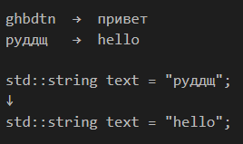
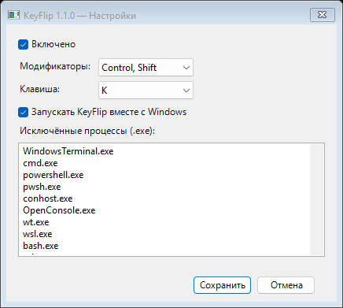

**[🇷🇺 Русский](../../README.md) • 🇬🇧 English**

# KeyFlip

[](https://github.com/pologovlev-collab/KeyFlip/actions/workflows/ci.yml)
[](https://github.com/pologovlev-collab/KeyFlip/releases/latest)
[](https://github.com/pologovlev-collab/KeyFlip/releases)
[](../../LICENSE)

KeyFlip is a small free Windows utility that fixes selected text typed using the wrong Russian or English keyboard layout.

`ghbdtn` → `привет` · `руддщ` → `hello`

Select text and press `Ctrl + Shift + K`. Everything runs locally and offline, with no AI, account, telemetry, or text sent over the internet.



## Download

| System | Architecture | Download | Status |
|---|---:|---|---|
| Windows 10 / 11 | x64 | **[KeyFlip_windows_x64.exe](https://github.com/pologovlev-collab/KeyFlip/releases/latest/download/KeyFlip_windows_x64.exe)** | Stable |
| Windows 10 / 11 | ARM64 | — | Planned |
| Linux / macOS | — | — | Not supported |

The current stable version is **KeyFlip 1.1.0**. It is a portable single-file EXE with the .NET runtime included. [View all releases](https://github.com/pologovlev-collab/KeyFlip/releases).

## Quick start

1. Download `KeyFlip_windows_x64.exe` from the official GitHub release.
2. Put it in a permanent folder and run it.
3. Select text in a supported application.
4. Press `Ctrl + Shift + K`.
5. Configure the hotkey and autostart from the KeyFlip system tray icon.

After moving the portable EXE, launch it manually once so KeyFlip can refresh its autostart path.



The current application version appears in the Settings window title bar beside the Close button.

## What's new in 1.1.0

- Reliable conversion of long mixed-layout phrases, including ambiguous short words and user typos.
- Safe preservation and restoration of empty, text, and image clipboard contents.
- A visible application version in Settings, startup diagnostics, and EXE properties.
- Deterministic behavior without requiring Windows system dictionaries.

## Examples

```text
ghbdtn
→ привет

This is a руддщ example
→ This is a hello example

как руддщ дела
→ как hello дела

std::string text = "руддщ";
→ std::string text = "hello";

зкште(ЭруддщЭ)
→ print("hello")

ghbdtn   vbh file.txt
→ привет   мир file.txt
```

## Features

- Context-aware Russian ↔ English conversion with local phrase direction.
- Complete physical US QWERTY ↔ Russian ЙЦУКЕН mapping, including Shift and symbols.
- Code-aware conversion that preserves valid syntax and fixes confidently recognized wrong-layout syntax.
- Formatting and paragraph preservation in Microsoft Word.
- File Explorer filename conversion with exact whitespace and final-extension preservation.
- Configurable global hotkey, system tray controls, and Windows autostart.
- Protected-field and terminal exclusion.
- Clipboard snapshot and safe restoration.
- Fully local and offline operation with no network features.

## How it works

A selection containing one alphabetic token uses direct physical-layout conversion. In longer text, KeyFlip determines a direction for each local clause and then handles ambiguous physical key clusters consistently. Known technical acronyms such as `SQL`, `API`, and `HTTP`, URLs, email addresses, and strongly supported English fragments are protected from accidental conversion. Spaces, tabs, and line endings are preserved exactly; punctuation attached to a converted word follows the same direction.

The normal operation is: protected-context check → clipboard snapshot → Copy → conversion → Paste → clipboard restoration. A confirmed VS Code Integrated Terminal aborts before `Ctrl+C` or any clipboard change; the editor and an unknown `Code.exe` context continue normally.

In code contexts, KeyFlip first creates a safe candidate that preserves existing ASCII punctuation. Wrong-layout quotes and other syntax positions change only when code indicators are strong. Microsoft Word uses targeted Range replacements, while a confirmed File Explorer rename context uses a separate filename policy that preserves the final extension.

## Compatibility

| System | Support |
|---|---|
| Windows 10 x64 | Yes |
| Windows 11 x64 | Yes |
| Windows 10 / 11 ARM64 | Planned; no native ARM64 build yet |
| Windows 7 | No — the current build uses .NET 8 |
| Linux / macOS | No — the application depends on WinForms, Win32, COM, and UI Automation |

## Security and privacy

KeyFlip does not send text anywhere, use AI, collect telemetry, require an account or internet access, or persist selected text. Diagnostic logs contain only safe operation stages, version data, and context classifications—never selected text, terminal commands, or clipboard contents.

The EXE is not code-signed yet, so Windows SmartScreen or antivirus software may show a warning. Do not disable protection: download only from the [official release](https://github.com/pologovlev-collab/KeyFlip/releases), verify SHA-256, or build from source.

The SHA-256 checksum for every build is published in its GitHub Release description. You can verify a downloaded file with:

```powershell
Get-FileHash .\KeyFlip_windows_x64.exe -Algorithm SHA256
```

## Known limitations

- Elevated applications may reject synthetic input due to Windows security boundaries.
- Password fields and confirmed terminals are intentionally ignored.
- KeyFlip safely aborts when a rare unsupported clipboard format cannot be preserved.
- Mixed formatting inside one individual Microsoft Word word may become uniform.
- Unusual Word add-ins and custom hosts may not provide a safe automation context.
- Unusual punctuation typed entirely in the wrong layout may remain unchanged in an ambiguous context.

## Build from source

Requirements: Windows and the .NET 8 SDK.

```powershell
.\build.ps1
```

The script performs a clean restore, builds Release, runs all automated tests, and creates a self-contained single-file win-x64 release under `artifacts\candidates\v1.1.0`.

See [docs/ARCHITECTURE.md](../ARCHITECTURE.md) for the technical overview, [CONTRIBUTING.md](../../CONTRIBUTING.md) to contribute, and the [MIT License](../../LICENSE).
